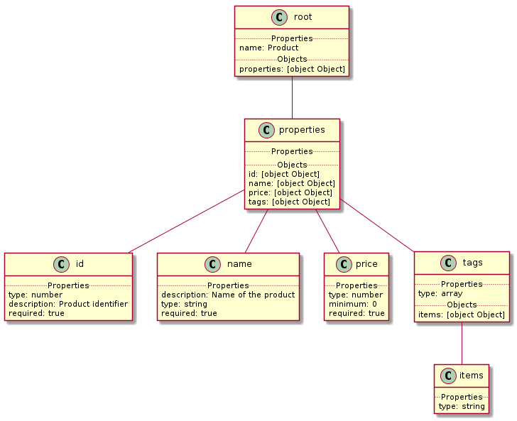
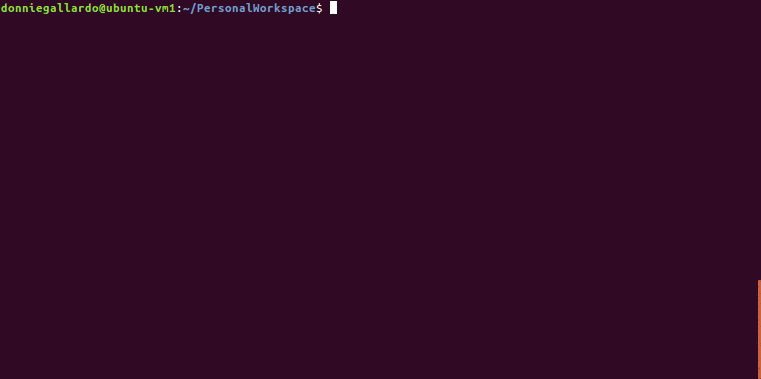

# json-to-plantuml
Transforms JSON to Plant UML to help visualize your JSON data.


## Example JSON data
```javascript
{
    "name": "Product",
    "properties": {
        "id": {
            "type": "number",
            "description": "Product identifier",
            "required": true
        },
        "name": {
            "description": "Name of the product",
            "type": "string",
            "required": true
        },
        "price": {
            "type": "number",
            "minimum": 0,
            "required": true
        },
        "tags": {
            "type": "array",
            "items": {
                "type": "string"
            }
        }
    }
}

```

## Example Plant UML outut


## As CMD line tool

### Install
```bash
$ npm install -g json-to-plantuml
```

### Run
```bash
$ echo '{"foo": "bar"}' | json-to-plantuml
$ json-to-plantuml -f .\data\albumdata.json
```

### Piping to PlantUML to generate image
```bash
$ echo '{"foo": "bar"}' | json-to-plantuml | java -jar plantuml.jar -pipe > topo.png
$ json-to-plantuml -f .\data\albumdata.json | java -jar plantuml.jar -pipe > topo.png
```





### Install Dependencies to generate image

> Java, Plant UML, GraphViz

#### Known to work with PlantUML following versions
plantuml-jar-lgpl-8048

plantuml-jar-lgpl-8049


## As project dependency

### Install
```bash
$ npm install --save json-to-plantuml
```

### Code
```javascript
var jsonToPlantUml = require('json-to-plantuml');

jsonToPlantUml('{"foo":"bar"}')
	.then(console.log)
	.catch(console.log);
```